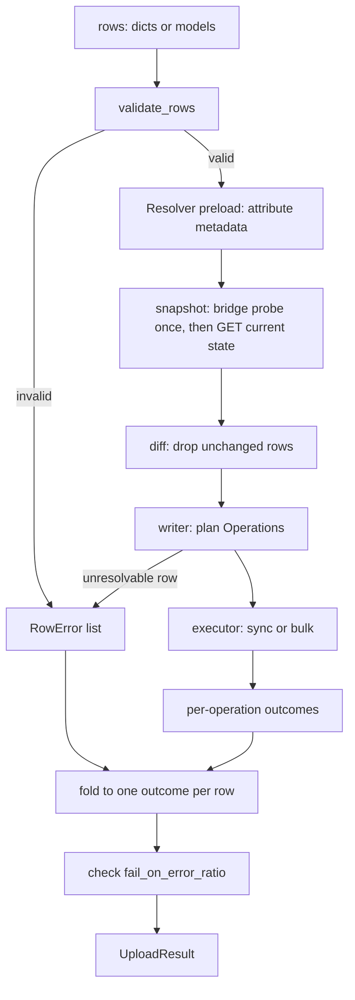

# Architecture

The library is split into small modules with one job each. `resource.py` is
the only module that sends HTTP to Magento; every other layer either shapes
data (formats, models), decides what to send (diff, writers), or orchestrates
calls through a `MagentoResource` (resolvers, executor, importers, bridge).
One `import_*` call always follows the same pipeline: validate the rows,
snapshot what Magento has now, drop rows that already match, plan
`Operation` values, execute them in sync or bulk mode, and fold the
per-operation outcomes into one outcome per row. This page maps the layers,
walks through that flow, and marks what is pure and what does I/O.

## Layers

| Module | Role | Talks to Magento? |
| --- | --- | --- |
| `formats/` (`readers.py`, `columns.py`, `catalog.py`) | Read csv/json/xlsx rows and map the native import columns onto row models. | No. Reads local files only. |
| `models.py` | Pydantic v2 row models (`ProductRow`, `PriceRow`, `CategoryRow`, ...) and `validate_rows`. | No. Pure. |
| `resolvers.py` | `Resolver`: attribute metadata and option ids, attribute sets and groups, websites, store views, category paths. Cached per import call. | Yes, through the resource. Reads, and also creates missing options and categories. |
| `diff.py` | Snapshots (products, prices, source items, media) and the comparison functions. | Yes, read only, through the resource. Comparison functions are pure. |
| `writers/` | One planner per entity: rows in, `PlanResult(operations, failed, skipped)` out. | Not directly. They call the resolver (which may POST an option or a category) and the media writer downloads images from their source. |
| `operation.py` | `Operation`, `BulkSpec`, `RowError`: frozen dataclasses. | No. Pure data. |
| `executor.py` | `execute()` runs operations in `sync` or `bulk` mode; `check_error_ratio`. | Yes, through the resource. |
| `bulk.py` | Async bulk submission results and status polling (`wait_bulk`, `map_detailed_status`). | Through the resource. |
| `upload.py` | `UploadResult`, `chunk_rows`, `run_upload`, `http_error_details`. | No. |
| `importers.py` | One function per entity composing the above, plus `to_materialize_result`. | Through the layers above. |
| `resource.py` | `MagentoResource`: token, retries, `get`/`post`/`put`/`delete`, bulk submission. | Yes. The only module that sends requests to Magento. |
| `bridge.py` | `BridgeClient` for the optional `DDTCoreX_DagsterBridge` module. | Through the resource. |
| `search.py` | `build_search_criteria`. | No. Pure. |

Dagster is imported only for logging (`get_dagster_logger`) and results
(`MaterializeResult`, `ConfigurableResource`): in `resource.py`,
`executor.py`, `formats/catalog.py` and `importers.py`. The planning and
execution logic does not depend on a running Dagster instance, which is why
you can call an importer from a plain Python shell.

The one HTTP call that does not go through `MagentoResource` is the media
image download in `writers/media.py` (`requests.get` on an http(s) image
source, 60 s timeout, no credentials sent).

## Data flow of one `import_*` call



The same flow as text, for `import_products`:

```text
rows
 |  _validate(ProductRow)                       pure
 v
valid rows -----------------------------------> invalid rows (RowError)
 |  _bridge(): GET dagster-bridge/capabilities   once per call, best effort
 |  Resolver.preload_attributes():               1 x GET products/attributes?attribute_code in (...) (repeated by the writer for changed rows)
 |  snapshot_products():                         GET products?sku in (<=50 SKUs), fields projection
 v
snapshot {sku: fields}
 |  product_matches_snapshot()                   pure; unchanged rows -> skipped_unchanged
 v
changed rows
 |  plan_products()                              resolver lookups, may POST missing options
 v
Operations: main save + store-value saves (+ configurable follow-ups)
 |  execute(parents)                             POST products / PUT products/{sku}
 |  execute(follow-ups)                          configurable options and child links,
 |                                               only for parents that succeeded
 v
UploadResult per operation
 |  _complete() / _fold_by_row()                 pure
 v
UploadResult per row, ratio checked
```

### 1. Validate

`_validate()` dumps a model instance with `exclude_unset=True` and validates
it again, so the set of fields a caller explicitly set survives. That matters
for products: `type`, `attribute_set` and `websites` are sent on an update
only when the row set them. A row that fails validation becomes a `RowError`
whose `row_ref` is the id field (`sku`, `code`, `path`, ...) or `row <index>`
when the id is missing.

### 2. Snapshot

Snapshots read only. Defaults (from `diff.py`):

| Snapshot | Endpoint | Chunking |
| --- | --- | --- |
| Products | `GET products` with `searchCriteria` `sku in (...)` and `fields=items[...]` | 50 SKUs per URL. A SKU containing a comma gets its own `eq` query. |
| Prices | `POST products/base-prices-information`, `special-price-information`, `tier-prices-information` with `{"skus": [...]}` | 1000 SKUs per body. |
| Source items | `GET inventory/source-items` via `get_paginated` | 50 SKUs per filter, page size 200. |
| Media | `GET products/{sku}/media` | One call per SKU that has images. |

With the bridge, the product snapshot uses the module's index and attribute
values instead, per capability. See [Optional-Bridge](Optional-Bridge).

### 3. Diff

A row is dropped as `skipped_unchanged` only when everything the writer would
send already equals the snapshot after normalization (decimals to 4 places,
datetimes to UTC `YYYY-MM-DD HH:MM:SS`, multiselect values sorted). Every
doubt answers "changed": an unresolvable label, a missing
`extension_attributes`, or any row part no snapshot covers (`store_values`,
variations, bundle options, grouped links, downloadable parts). Not every
importer diffs:

| Importer | Diff |
| --- | --- |
| `import_products` | Snapshot plus `product_matches_snapshot`. `behavior="disable"` compares only `status == 2`. |
| `import_prices` | Snapshot of the three price information endpoints. |
| `import_source_items` | `(quantity, status)` per `(source_code, sku)`. |
| `import_media` | Gallery snapshot always read; same position and label means skip. |
| `import_attributes` | The writer diffs options against the resolver cache; `diff` is ignored. |
| `import_attribute_sets` | Pass based, converges on already applied operations. |
| `import_categories`, `import_sources`, `import_stocks`, `import_stock_source_links` | No snapshot; `diff` is ignored. |

### 4. Plan

Writers turn rows into `Operation` values. An `Operation` carries:

| Field | Meaning |
| --- | --- |
| `method`, `endpoint`, `payload` | The synchronous REST call, for example `PUT products/TEE-RED-M` with `{"product": {...}}`. |
| `row_refs` | The row ids this operation belongs to. Used to fold outcomes. |
| `store_code` | REST scope for this call; `None` means the resource's `store_view`. |
| `list_key` | Set for list endpoints (`prices`, `sourceItems`, `links`): many operations are merged into one request body under this key. |
| `chunk_key` | List operations sharing a non-None key are never split across requests (all tier prices of one SKU in replace mode). |
| `bulk` | Optional `BulkSpec(endpoint, payload, phase)`: how to send this in bulk mode. Operations without one run synchronously even in bulk mode. |

`Operation` and `BulkSpec` are frozen and hashable, and payloads are copied
before they are wrapped into a request, so a plan can be inspected or reused.
Writers never send their own operations, but planning is not side effect free:
the resolver creates a missing select option (`POST
products/attributes/{code}/options`) or a missing category (`POST categories`,
or the bridge upsert) while the plan is built, and the media writer downloads
image bytes. Those creations happen even if you never execute the plan.

### 5. Execute

`executor.execute(resource, operations, mode)` sends the plan. In sync mode,
list operations are grouped by `(method, endpoint, store_code, list_key)` and
sent in chunks of 1000, and single operations go one request each. In bulk
mode operations with a `BulkSpec` are grouped by `(phase, method,
bulk_endpoint, store_code)`, submitted to `async/bulk/V1/...` in chunks of
200, and polled until done. Phases run in ascending order in both modes.
Everything about this step is on
[Sync-and-Bulk-Execution](Sync-and-Bulk-Execution).

`import_products` calls `execute` twice: first for the operations on
`products` endpoints (main saves and store-value saves), then for the
follow-ups (configurable options and child links), dropping follow-ups whose
parent failed or is pending and child links that already exist.

### 6. Fold

The executor counts each operation's `row_refs`, so a row with three
operations would count three times. `_fold_by_row` turns that into one outcome
per row: failed if any of its operations failed (or planning failed it),
otherwise pending if any is pending, otherwise succeeded. Rows the writer
planned nothing for, that were not failed or skipped, count as
`skipped_unchanged` (except categories, where resolving the path is itself the
work). Then `fail_on_error_ratio` is applied. See
[Results-and-Errors](Results-and-Errors).

## Pure versus HTTP, at a glance

```text
pure (no I/O)                       I/O through MagentoResource          other I/O
---------------------------------   ----------------------------------   ------------------------
models.validate_rows                resolvers.Resolver                   formats.read_rows (files)
diff.normalize, *_matches_snapshot  diff.snapshot_*                      writers.media.load_image
diff.split_changed                  executor.execute                       (http(s) GET or file)
operation.*                         bulk.wait_bulk
search.build_search_criteria        bridge.BridgeClient
upload.chunk_rows, UploadResult     importers.import_*
formats.columns (string parsing)
writers.* (given a resolver stub)
```

The test suite relies on this split: writers are tested against an in-memory
`FakeResolver` (`tests/writers/conftest.py`), and the layers that do HTTP are
tested with `requests_mock`, never a live Magento, in the default run.

## Error boundaries

| Raised | Where | Caught by | Effect |
| --- | --- | --- | --- |
| `pydantic.ValidationError` | model validation | `validate_rows` | Row fails, run continues. |
| `ResolveError` | resolver | writers | Row fails, run continues. |
| `requests.exceptions.HTTPError` | resource, after retries | executor, `run_upload`, media snapshot | The request's rows fail, run continues. |
| `MagentoAuthError` | token fetch | nothing | Run aborts. |
| `MagentoImportError` | ratio check; bridge failures with `use_bridge="require"` | nothing | Run aborts. |
| `requests.ConnectionError`, `requests.Timeout` | resource | nothing in the library | Run aborts (they are not `HTTPError`). |

## Gotchas

- Planning creates options and categories. A dry run that only plans is not
  read only.
- Each importer that resolves names (`import_attributes`, `import_attribute_sets`,
  `import_categories`, `import_products`, `import_stocks`) builds a fresh
  `Resolver` and, unless `use_bridge="never"`, a fresh `BridgeClient`, so caches
  and the capability probe last one call, not one Dagster run. The price, source,
  source item, media and stock source link importers build neither.
- The whole plan is held in memory before execution starts, including base64
  image payloads for media. Split large catalogs across assets.

## See also

- [Home](Home)
- [Getting-Started](Getting-Started)
- [MagentoResource](MagentoResource)
- [Sync-and-Bulk-Execution](Sync-and-Bulk-Execution)
- [Results-and-Errors](Results-and-Errors)
- [Catalog-Importers](Catalog-Importers)
- [Row-Models](Row-Models)
- [File-Formats](File-Formats)
- [Optional-Bridge](Optional-Bridge)
